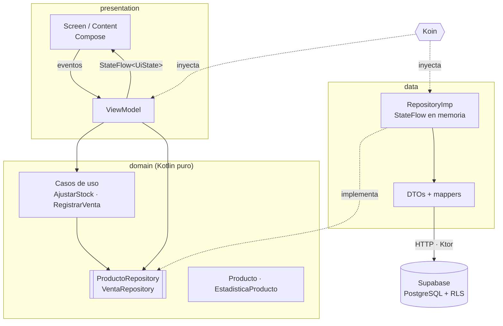

# StockWise

[](https://github.com/MilagrosMaldonadoMedrano/StockWise/actions/workflows/ci.yml)


Gestor de inventario para Android e iOS con **Kotlin Multiplatform** y **Compose Multiplatform**: lógica, datos y UI compartidos en un único módulo, con backend en **Supabase**.

Permite administrar productos (alta, edición, baja y ajuste de stock con alertas de stock bajo), registrar ventas y ver un dashboard con la ganancia por producto.

## Funcionalidades

| Pantalla | Qué hace |
| --- | --- |
| **Lista** | Productos ordenados por nombre, alerta de stock bajo, estados de carga, vacío y error con reintento |
| **Detalle** | Ajuste de stock (+/−), registro de ventas con validación en vivo, costo y ganancia por unidad, eliminación con confirmación |
| **Formulario** | Crear y editar con validación por campo, teclado numérico y detección de SKU duplicado |
| **Ventas y ganancias** | Ganancia total, ingresos, unidades vendidas y ranking de productos por ganancia |

## Arquitectura

**MVVM + Clean Architecture liviana + flujo unidireccional de datos (UDF).**



**Por qué esta arquitectura**

- **`domain` no depende de nada** (ni Supabase, ni Compose). `presentation` y `data` dependen de sus interfaces. Cambiar de backend solo toca `data`, y los ViewModels se testean con repositorios falsos.
- **Clean "liviana":** solo hay casos de uso donde existe una regla de negocio real (`AjustarStockUseCase`: el stock nunca queda negativo; `RegistrarVentaUseCase`: no se vende más de lo disponible). Listar o eliminar van directo al repositorio, para no crear clases que solo delegan.
- **Única fuente de verdad:** el repositorio de productos (`single` en Koin) expone un `StateFlow<List<Producto>?>`. Lista y detalle lo observan: un cambio en el detalle se ve en la lista sin pedir nada a la red. `null` = no cargado (spinner) y lista vacía = sin productos.
- **UiState como `sealed interface`** (`Cargando`, `Vacio`, `Exito`, `Error`), derivado con `combine` + `stateIn(WhileSubscribed(5_000))`. Los estados contradictorios son imposibles y el estado sobrevive a la rotación. El formulario es la excepción consciente: un `data class` propio que funciona como borrador.
- **State hoisting:** cada pantalla es `XxxScreen` (obtiene el ViewModel y observa) + `XxxContent` (sin estado, solo dibuja).
- **DTO separado del modelo** con `@SerialName` para `snake_case` ↔ `camelCase`. Los errores de Supabase se traducen a excepciones del dominio en `data` (por ejemplo, Postgres `23505` → `SkuDuplicadoException`), así `presentation` no sabe que existe Supabase.

## Decisiones técnicas

| Decisión | Motivo |
| --- | --- |
| **Supabase** en lugar de Firebase | `supabase-kt` es nativo de KMP; Firebase no tiene SDK oficial multiplataforma. Postgres aporta restricciones (`check`, `unique`, claves foráneas) y RLS |
| **Venta como función de Postgres** (`registrar_venta`, RPC) | Descuenta stock y registra la venta en **una transacción**: sin estados intermedios si se corta la red, y sin carreras entre dispositivos |
| **Estadísticas en una vista SQL** | El agregado se calcula en la base: viajan pocas filas aunque haya miles de ventas. Cada venta copia el precio y el costo del momento, así la historia no cambia si cambian los precios |
| **Validación en app y en base** | La app responde al instante sin ir a la red; la base es la última barrera (`check (cantidad >= 0)`) |
| **Navegación type-safe** (`@Serializable` routes) | Los parámetros se verifican al compilar. Los resultados entre pantallas viajan por el `SavedStateHandle` de la entrada anterior |
| **Koin** | Hilt no soporta KMP. Koin es multiplataforma y se integra con `ViewModel` y Compose |
| **Sin APIs de Java en `commonMain`** | Kotlin/Native no tiene JVM: por ejemplo, el formato de precios evita `String.format`. El CI compila iOS en cada PR para detectarlo |

**Seguridad.** La key incluida en `SupabaseProvider.kt` es la key **pública** (diseñada para viajar en el cliente). Los permisos los define RLS. La política actual es abierta porque la demo no tiene login. La `service_role` key nunca se usa ni se versiona.

## Calidad

- **42 unit tests** en `commonTest` (casos de uso, ViewModels, validador, formato). Corren en Android (JVM) y en iOS (Kotlin/Native), con repositorios falsos en memoria y `kotlinx-coroutines-test`.
- **CI con GitHub Actions** en cada push y PR: tests + APK descargable en `ubuntu-latest`, framework iOS + tests en el simulador en `macos-latest`.
- **QA manual en emulador** contra Supabase real, incluidos casos borde: doble toque en navegación (`dropUnlessResumed`), toques rápidos durante una operación, errores de red, SKU duplicado y venta sin stock.
- **Git:** Conventional Commits, una rama y un Pull Request por funcionalidad, merge con CI en verde.

## Uso de IA

| Herramienta | Uso |
| --- | --- |
| **Claude (chat)** | Diseño de la arquitectura y del modelo de datos, aprendizaje de KMP/Compose, primeras capas (domain, data, lista) |
| **Claude Code** (agente en el repo) | Implementación incremental de cada funcionalidad, CI, diagnóstico del entorno, verificación de versiones contra Maven Central y QA en el emulador vía `adb` (capturas + `logcat`) |

**Cómo se orquestó:** un archivo de contexto con requisitos, convenciones (nombres de dominio en español, términos técnicos en inglés) y arquitectura. Pasos chicos con criterio de aceptación explícito: compilar, correr los tests y probar en el emulador antes de cada commit. Cada funcionalidad en su rama y su PR.

**Errores de la IA detectados y corregidos** (la auditoría fue parte central del proceso):

| Problema | Cómo se detectó | Corrección |
| --- | --- | --- |
| `ProductoRequestDto` sin `@SerialName("stock_minimo")`: leer funcionaba, toda escritura fallaba (`PGRST204`) | Probando el ajuste de stock contra Supabase real | Mapeo corregido; a partir de ahí, toda funcionalidad nueva se probó también escribiendo en la base |
| `catch (e: Exception)` atrapaba `CancellationException`: errores falsos y cancelación rota | Revisión del código generado | Se relanza explícitamente en todos los ViewModels |
| Errores técnicos (URL, headers) mostrados al usuario | QA en emulador | Mensajes amigables; el detalle técnico no llega a la UI |
| Función SQL que actualizaba `updated_at`, columna que no existe en la base real | Log temporal + `logcat` al fallar la venta en el emulador | Función corregida; verificar contra la base real, no contra la documentación |
| Tests de ViewModel que nunca recolectaban el `StateFlow` (`WhileSubscribed`) | Revisión antes de correrlos | Recolección con `UnconfinedTestDispatcher(testScheduler)` |
| Nombres inconsistentes tras traducir el dominio y rutas de módulo incorrectas (`composeApp` vs `shared`) | Errores de compilación | Corregidos de forma integral |

Problemas de entorno resueltos con ayuda de la IA: el Sync de IntelliJ fallaba con `BUILD SUCCESSFUL`, y se diagnosticó con `idea.log` que el IDE había actualizado el wrapper a Gradle 9.8.0 (se fijó en **9.5.1**). Además, `JAVA_HOME` estaba mal configurado y `gradlew` no tenía permiso de ejecución en git, lo que rompía el CI en Linux/macOS.

## Cómo correrlo

**Requisitos:** JDK 21, Android SDK (API 37) y un emulador o dispositivo con Android 8.0+ (minSdk 26). Para iOS: macOS con Xcode.

```bash
git clone https://github.com/MilagrosMaldonadoMedrano/StockWise.git
cd StockWise

# Instalar en el emulador o dispositivo conectado
./gradlew :androidApp:installDebug

# Generar el APK -> androidApp/build/outputs/apk/debug/
./gradlew :androidApp:assembleDebug

# Tests
./gradlew :shared:testAndroidHostTest          # Android (JVM)
./gradlew :shared:iosSimulatorArm64Test        # iOS (requiere macOS)
```

**iOS:** abrir `iosApp/iosApp.xcodeproj` en Xcode y ejecutar.

**Backend:** la app apunta a un proyecto de Supabase ya configurado, así que no requiere setup. Para recrearlo: tabla `productos` (`id uuid`, `nombre`, `sku unique`, `categoria`, `cantidad`, `stock_minimo`, `precio numeric(12,2)` con `check` ≥ 0) y luego [`supabase/ventas.sql`](supabase/ventas.sql) (costo, ventas, función y vista).

> Usar Gradle 9.5.1, la versión del wrapper. Con 9.8.0 el Sync de IntelliJ falla.

## Limitaciones conocidas

- **iOS** compila y pasa los tests en CI, pero no se probó visualmente: el desarrollo se hizo en Windows, sin Mac.
- **Sin autenticación:** políticas RLS abiertas. En producción se agregaría Supabase Auth con políticas por usuario.
- El ajuste manual de stock (+/−) envía el producto completo (gana la última escritura). Las ventas no tienen este problema porque usan la función transaccional.
- Sin modo offline: la app requiere conexión.

---

Desarrollado por **Milagros Maldonado Medrano** para el challenge técnico de AranguriApps.
